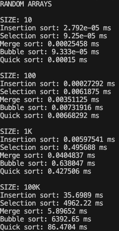
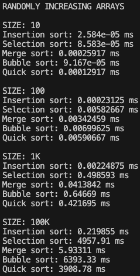
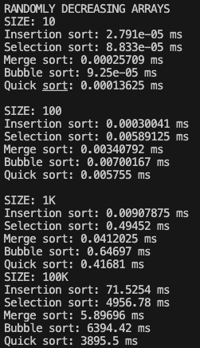

Shahbaj Singh
CS 435 Section 102
Professor Nahata
____

Programming Assignment 1
===

##### Abstract

Implementation of

> `INSERTION SORT`
> `SELECTION SORT`
> `MERGE SORT`
> `BUBBLE SORT`
> `QUCIKSORT`

on arrays of sizes varying from 10, 100, 1000, to 100 000 (100K) in order to analyze differences between runtime at varying values of input `n`.

____

 ##### Running the Program

  

While I had originally intended for this program to be ran in a `.ipynb` file, but I
encountered setbacks on my system when trying to run computationally taxing cells
in the notebook, namely on values of input `n = 1M`; upon consultation with my
peers, I decided therefore to rewrite my sorting algorithms in C++11, and reduce the
number of large iterations by a magnitude of 10, from `n = 1M` to `n = 100K`, as while
`n = 1M` did complete successfully on my system for most tests, I encountered persistent
issues in sorting randomly increasing and decreases arrays of this size with `quicksort`.

The entirety of the program may thus be found in <code>[comparing_sorting_algorithms.cpp](/prog-ass-1/sorting_algorithms/comparing_sorting_algorithms.cpp)</code>; it makes use of the following C++ libraries:

- `iostream`
- `vector`
- `random`
- `ctime`
- `map`

and can be run using the C++ compiler of your choice; I used the commands

> `cd sorting_algorithms`

> `clang++ -std=c++11 -o csa comparing_sorting_algorithms.cpp`

> `./csa`

 

____

##### Results

 

Running the `.cpp` file as above should yield results not too dissimilar from
the following, which were output on my system:

For normalization purposes and to ease interpretation I will transcribe the results of each sorting algorithm rounded to the nearest nanosecond (ns), partitioned by testing specifications (size and random nature of array).

 

____

##### Performance Analysis

 

_**RANDOM ARRAYS**_

|Algorithm|`n = 10`|`n = 100`|`n = 1K`|`n = 100K`|
| ---     | ---    | ---     | ---    | ---      |
|Insertion Sort|28 ns|273 ns|5,975 ns|35,698,900 ns|
| Selection Sort |92 ns|6,188 ns|495,688 ns|4,962,220,000 ns|
| Merge Sort |255 ns|3,511 ns|40,484 ns|5,896,520 ns|
| Bubble Sort |93 ns|7,319 ns|638,047 ns|6,392,650,000 ns|
| Quicksort |150 ns|6,683 ns|427,506 ns|86,470,400 ns|

_**RANDOMLY INCREASING ARRAYS**_

|Algorithm|`n = 10`|`n = 100`|`n = 1K`|`n = 100K`|
| ---     | ---    | ---     | ---    | ---      |
|Insertion Sort|26 ns|231 ns|2,249 ns|219,855 ns|
| Selection Sort|86 ns|5,827 ns|498,593 ns|4,957,910,000 ns|
| Merge Sort|259 ns|3,425 ns|41,384 ns|5,933,110 ns|
| Bubble Sort|92 ns|6,996 ns|646,690 ns|6,393,330,000 ns|
| Quicksort|129 ns|5,907 ns|421,695 ns|3,908,780,000 ns|

_**RANDOMLY DECREASING ARRAYS**_

|Algorithm|`n = 10`|`n = 100`|`n = 1K`|`n = 100K`|
| ---     | ---    | ---     | ---    | ---      |
|Insertion Sort|28 ns|300 ns|9,079 ns|71,525,400 ns|
| Selection Sort |88 ns|5,891 ns|494,520 ns|4,956,780,000 ns|
| Merge Sort|257 ns|3,408 ns|41,202 ns|5,896,960 ns|
| Bubble Sort|92 ns|7,002 ns|646,970 ns|6,394,420,000 ns|
| Quicksort|136 ns|5,755 ns|416,810 ns|3,895,500,000 ns|

With this information, we have the average runtimes for each algorithm on a variety of input sequences, tested 100 times and averaged so we may ensure ourselves that it is accurate. The clearest differences are those that are most immediate and stark– of course, larger input sizes necessitate longer running times, often with magnitudes of difference, but the implication of time complexities stand out as we compare the time to sort across each algorithm.

The most striking immediate difference lies in the `merge sort` algorithm, which is able to sort arrays of input size `n = 100K` at a speed which is magnitudes of difference ahead of its competitors. While other algorithms take tens of hundreds of millions, or even billions, of nanoseconds to finish sorting arrays in any random order, `merge sort` took less than six million nanoseconds in each case; for reference, this is the difference between $0.005s$, less than a tenth of a second, and $0.5s$ - $5s$ between merge and its competing algorithms.

The answer to why this may be lies in the best and worst case time complexities of these algorithms. While `insertion sort` and `bubble sort` have best case time complexities of $\Omega(n)$, they performed quite consistently across each of the test orderings (random, increasing, decreasing), meaning that, like `selection sort`, they tended towards their slower, average time complexity: $\theta(n^2)$, the same as their worst case time complexity $O (n^2)$.

`Quicksort`, while sharing the same best and average case time complexity with `merge sort` ($\Omega(n \times log(n))$ and $\theta(n \times log(n))$ respectively), dwarfed in comparison to its competitior when input sizes grew too large, tending towards its worst case time complexity $O (n^2)$.

`Merge sort` retains a consistent time complexity of $\theta(n \times log (n))$ across the board, for both best case and worst case; making use of an auxillary function, as `quicksort` does with `partition()`, but rather for merging subarrays, merge sort stands out as superior among the five algorithms analyzed for sorting information that is in any manner of random fashion, whether it is tasked to sort arrays increasing or decreasing in steps or completely random ones.

____
