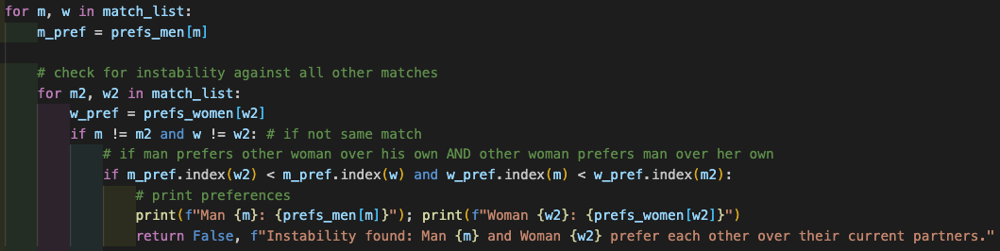

Shahbaj Singh
CS 435 Section 102
Professor Nahata
____

Programming Assignment 2
===

##### Abstract

Implementation of Gale-Shapely algorithm on lists of size `10`, `100`, `1000`, `10 000`, and `100 000` in order to visualize and validate the stability of the algorithm over various input sizes.

I followed various implementations of the Gale-Shapley program from research I did online, but ultimately what was easiest for me was going back to my lecture notes from the first day, reworking the logic of the algorithm in my mind, and rewriting it thereafter in python. The bulk of the analysis draws from two function: `gale_shapely()`, the implementation of the algorithm itself, and `val_stable()`, which validates the stability of the match list returned by the former. Initially, I had trouble getting the algorithm to be proved stable, but I found myself erring actually in how I was comparing the matches– I found that I was mistakenly using the preference list of the original women in this loop:

i.e., I had defined `w_pref` as `prefs_women[w]` in the outside loop; as you can see, this was corrected and `w_pref` was placed inside the correct loop where it could access the `w2` variable and correctly compare against `m_pref`.

____

 ##### Running the Program

This program may be ran through the command line by `cd`ing into the working directory of the file [gale_shapley_.py](/prog-ass-2/gale_shapley_.py), and running the command

`python3 gale_shapley_.py`

Which will randomly generate preference lists of men and women of input sizes `n = 10, 100, 1000, 10000, 100000` and for each input size iteration, run the Gale-Shapley algorithm in order to create stable matches, and then run the validation function to prove that they are in fact stable matches. In my experience, validation takes significantly longer than actual execution of the algorithm (as `gale_shapley()` approaches $O(n^2)$, while `val_stable()` approaches $O(n^3)$ with a list lookup and comparison in its nested for-loop), so I also implemented a manual debugging feature which tracks the progress of matching, at the end of which validation begins.

After validation has completed, the `.py` script will generate a plot of the execution times as a function of input size. It makes use of the following Python libraries:

* `random`
* `time`
* `pyplot`– a module from `matplotlib`

  

____

##### Results

We find that, as expected, the execution time increases almost parabolically with input size as the time complexity of Gale-Shapley is $O(n^2)$. If we were to compare this to a brute-force implementation, say in the form of:

<code>
stable_match_forced(women, men, pref_rank_w, pref_rank_m)
    
    w_rank = Convert pref_rank_w to rank format
    m_rank = Convert pref_rank_m to rank format

    w_seq = Convert women set to sequence
    Initialize matching collection with all possible pairings of women and men

    For each possible match in matching collection
        Create a dictionary match_w mapping each woman to her pair in the match
        Create a dictionary match_m mapping each man to his pair in the match

        Set unstable to False

        For each woman w in women
            For each man m in men
                If w is not paired with m in match_m AND m is not paired with w in match_w
                    If woman w prefers man m over her current partner AND man m prefers woman w over his current partner
                        Set unstable to True
                        Break inner loops

        If the match is not unstable
            Return the stable match
</code>

using the `permutations` module from the `itertools` library, we would probably not even be able to test it for comparison, as it would take on a time complexity of $O(n! \times n^2)$; Gale-Shapley is thus a far superior implementation of a stable matching algorithm, which is why it earned the Nobel Prize. The algorithm completes successfully in mere seconds; the overwhelming time and resource consumption of the program in [gale_shapley_.py](/prog-ass-2/gale_shapley_.py)is mainly the validation for actually checking that the stable match is valid (which it always is).

Because the validation was so time consuming compared to running the algorithm, for `n = 100000`, I skipped the validation as it had already been proved stable over multiple runs, so that I could produce a plot within reasonable time. Displayed are the execution times I was able to extract, and the plot that was generated with them.

 

____

##### Performance Analysis

The implementation of this algorithm as a logical continuation of the theory and pseudocode covered in class is proof that the Gale-Shapley algorithm always returns a stable matching. The validation function follows the logic of comparison discussed, by comparing, for each and every sample input, their preferences against that of the individual loop iterate in question. The successful production of the execution time plots against the varied-magnitude input sizes further adds to the validity of this claim.

Beyond the time plots, analyzing the standard output logs proves that the Gale-Shapley algorithm produces a best-valid-match scenario for men and worst-valid-match scenario for women among stable matches as it is implemented, with men as the proposers and women as the 'upsizers'. One would assume that it would be reversed, as the women are the upsizers, but in fact, the men draw the advantage from the fact that it is their list which the flow of control moves down, thus they get their highest preference at first, while women are matched and only get to trade up if their respective preference is either already unmatched or has not gotten to his highest preference yet. Thus in stable match lists, a man ends up with the match highest on his preference list that _would_ accept him, whereas a woman ends up with the match lowest on her preference list, because she cannot guarantee that a higher preference man would propose to her, so she must accept any current partner.

 

____
