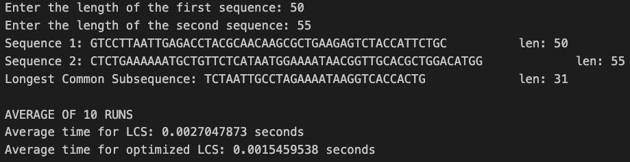
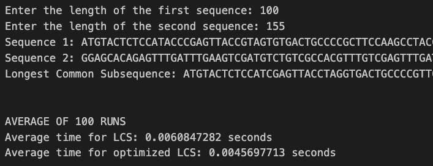
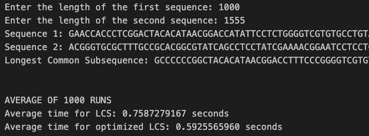

Shahbaj Singh
CS 435 Section 102
Professor Nahata
____

Programming Assignment 3
===

##### Abstract

Implementation of Longest Common Subsequence (LCS) algorithm for two given sequences of characters: A, C, T, and G. String input sequences are programatically compared and the longest common subsequence between them algorithmically determined. Each string sequence is at least `n=50` characters long. My approach was entirely motivated by the procedural explanation from the book which fared best for my understanding, and from what was discussed during lectures; the use of intermediate 2D table, both to process the sequences as well as to print them, has been included, and optimizations made at the behest of the book to reduce the necessary space down to just one table; though the book explicably refuted the space complexity optimization of this last implementation, the _Results and Analysis_ section of this README shows that time complexity was, in fact, optimized.

_Input:_

Two sequences of characters (A | C | T | G) represented as strings, each with a minimum length of `n=50` characters

_Output:_

The Longest Common Subsequence (LCS) of the given input sequences

##### Program Implementation

* A function named `longest_common_subsequence()` taking two string input sequences as arguments and returning the string representation of the Longest Common Subsequence (LCS)

* A function named `print_lcs()` which prints the results of the LCS c table using the intermediate b table

* A dynamic programming approach to solving the LCS problem, using a 2D table to store intermediate results

* Input sequences meet the minimum length constraints of `n>=50` characters, with an exception raised if they do not

* An optimized function `longest_common_subsequence_optimized()` taking the same input as `longest_common_subsequence()` but implemented such that the construction of the b table is omitted and c[i,j] entries are calculated using the c table itself, optimizing asymptotic time complexity from the order of `m*n` to `m+n`

##### Running the Program

This program may be ran through the command line by `cd`ing into the working directory of the file [lcs.py](/prog-ass-3/lcs.py), and running the command

`python3 lcs.py`

This will prompt you to enter two integer values for `m` and `n`, the sizes of the _X_ and _Y_ sequences respectively. The program will then run 10 times and compute using the `time` library the average runtimes of the optimized and unoptimized LCS algorithms on two random sequences of nucleotides (A, T, C, or G) of lengths `m` and `n` respectively.

The program will prompt you to do this twice over, and will compute 100 and 1 000 times respectively, proving the consistency of the algorithm across varying input sizes in the following analysis section.

##### Results and Analysis

For the three main loops in my program, I decided to test sequence size pairs of 50 and 55, 100 and 155, and 1000 and 1555. The full output of my run is pasted in [output.txt](/prog-ass-3/output.txt). The results are as follows:

The length of the longest common subsequence found between the sequences averaged at around 60-70% of the length of the shorter substring; the most notable conclusion we can draw is that further optimizing the algorithm by internalizing the modularity provided by the b table did allow us to create significant differences in time complexity, most expressly noticeable in the longer sequences of `m=1000` and `n=1555` in which the optimized algorithm different by over 0.15 seconds, or over 150 milliseconds.

Though this does not seem like a significant difference on such a trivial scale, when the problem is expanded to the size of full genome comparisons, where nucleotide pairs can number in the multiple hundreds of thousands, the specific programming paradigm one chooses to follow, in our case a dynamic programming approach, will greatly dictate how efficiently results are computed. 

We conclude with the extrapolated knowledge that a dynamic programming bottom-up approach for finding LCS between any two sequences, as they need not strictly be nucleotides, fares better with lookup optimizations as the size of these sequences increases, as the number of comparisons which need me made scales similarly. The 150ms difference we displayed accurate displays the difference between an algorithm with $O(m\times n)$ time complexity and one with $O(m+n)$.

