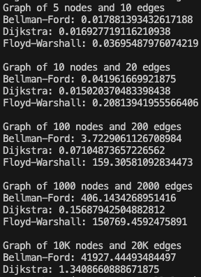

Shahbaj Singh
CS 435 Section 102
Professor Nahata
____

Programming Assignment 4
===

##### Abstract

Implementation of three shortest path algorithms: Bellman-Ford, Dijkstra, and Floyd-Warshall. 

_Input:_

None

_Output:_

The timed performance of each algorithm on randomly weighted graphs of node counts 5, 10, 100, 1000, and 10000, with measures taken to disallow any negative cycles.

##### Program Implementation

* A class to define a graph object (a path error was encountered on my system– M1 MacBook Air– which did not allow me to use `networkx`, thus the manual implementation)

* A function to implement the Bellman-Ford algorithm

* A function to implement Dijkstra's shortest path algorithm

* A function to implement the Floyd-Warshall algorithm

##### Running the Program

This program may be ran through the command line by `cd`ing into the working directory of the file [spa.py](/prog-ass-4/spa.py), and running the command

`python3 spa.py`

This will generate random graphs for each iteration, consisting of 5, 10, 100, 1 000, and 10 000 nodes, perform the algorithms to optimize each one, and return the time (in milliseconds) taken for each function (see _Results and Analysis_).

##### Results and Analysis

We see that with a few amount of nodes and edges, up to 100 even, the algorithms perform similarly, besides Floyd-Warshall, which failed to even pass 10 000 nodes in a timely manner. As the number of nodes and edges increases into the thousands and ten thousand, we see the superiority of Dijkstra's shortest path algorithm emerge as its performance dwarves those of the other two by multiple orders of magnitude. This makes clear its superiority and ingenuity despite its simplicity, much to my surprise, as I found Floyd-Warshall itself very intuitive and would have thought that it would perform better. I understand this shortcoming when performing tests and wish that I had allotted myself some more time to run more thorough tests. 